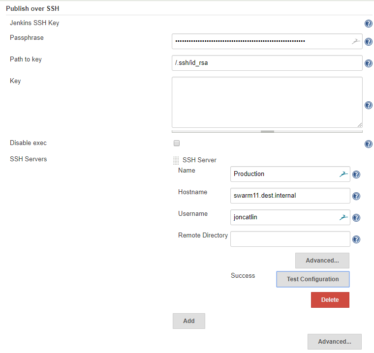
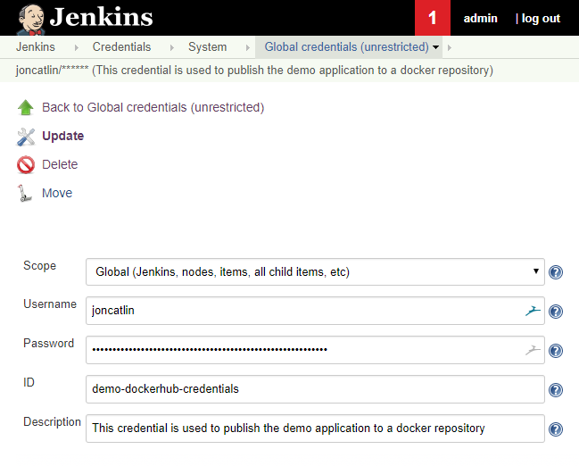
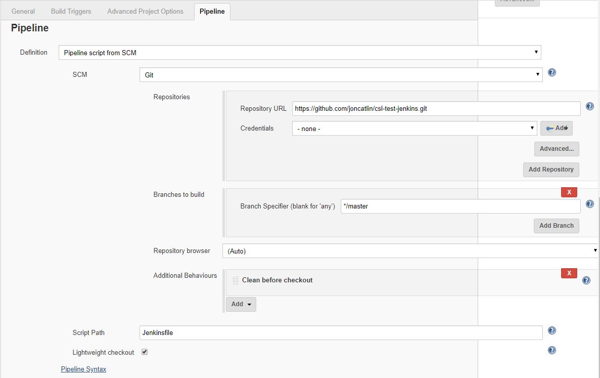
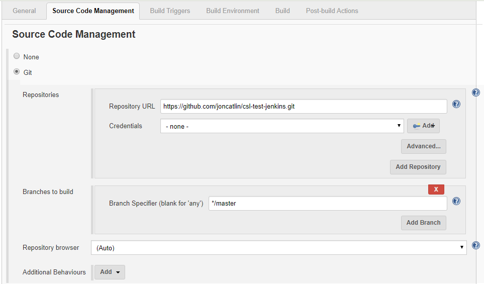

# Jenkins in Docker Swarm
This repo contains a reference implementation of Jenkins containers running in a docker swarm environment. It is designed to show how Jenkins can run in a swarm, build, test and locally deploy a container to the same swarm that Jenkins is running in. The reference implementation also shows how a container can be deployed to another swarm using ssh. This demonstrates how a development swarm cluster could be used to deploy into a more secure staging or production swarm.

# Logical view of the deployment
The deployment process will create a single Jenkins Master and several Jenkins slaves inside of a single docker swarm. More slaves can be added by changing the number of slave replicas in the compose file called [jenkins-swarm.yml](jenkins-swarm.yml). The file contains the following configuraiton extract. To increase the number of Jenkins slaves just increase the `replicas: 3` to the number of slaves required :-

```
  jenkins-slave:
    image: joncatlin/jenkins-swarm-slave
    volumes:
      - /var/run/docker.sock:/var/run/docker.sock
    networks:
      - jenkins_net
    secrets:
      - source: jenkinsSwarm
        target: jenkinsSwarm
        mode: 0440
    deploy:
      replicas: 3
```
The slave nodes will continue to try to connect to the master node. So the startup ordering of the containers does not matter. 

# Swarm preparation
The folowing preparation must be done on the swarm, prior to deploying Jenkins. 
## Configure the JENKINS_HOME permanent storage
The [jenkins-swarm.yml](jenkins-swarm.yml) file configures a bind mount for the JENKINS_HOME directory. The following extract shows in the ref implmentation that this is located at `/mount/VM-File-Storage/jenkins-master`. This location should be changed to a share that all of the swarm nodes can access. This will ensure that whatever swarm node the master is started on it can access this directory.

```
  jenkins-master:
    image: joncatlin/jenkins-swarm-master
    volumes:
      - /mount/VM-File-Storage/jenkins-master:/var/jenkins_home
```

This shared directory should be backed up in order to safeguard it against loss.

## Potentially change the port that Jenkins gui will connect on
In the [jenkins-swarm.yml](jenkins-swarm.yml) file the Jenkins master is set to listen on the swarm port 8080, see the extract below.
```
  jenkins-master:
    image: joncatlin/jenkins-swarm-master
    volumes:
      - /mount/VM-File-Storage/jenkins-master:/var/jenkins_home
    ports:
      - "8080:8080"
```
If there is already something using that port and change the compose file to use a different one, for example 8085 like the example below.
```
    ports:
      - "8085:8080"
```
## Swarm secrets
In order to secure the deployment, various secrets are needed to be created. These secrets can be created from a console on one of the manager nodes in the swarm and using the following commands:-

```
echo admin | docker secret create jenkinsUser -

echo admin | docker secret create jenkinsPassword -

echo -master http://jenkins-master:8080 -password admin -username admin | docker secret create jenkinsSwarm -
```

There are three secrets, the first two are for the username and password of the Jenkins administrator account. This account will be created when Jenkins is deployed into the swarm and it is what the user will login as in order to administer the Jenkins cluster.

The third secret is for the slaves to connect automatically to the master and login using the administrator account. 

In the examples above the username and password are `admin` in each case. Be sure to set the appropriate values in each of the secrets.

## Generate ssh key
The demo Jenkins installation uses ssh to copy files and execute commands on another swarm. This is designed to show that Jenkins can deploy docker compose files to another swarm and then execute them in order to start a container running on a different swarm. This could be used to deploy to a staging or a production environment, where you want a security barrier in place between the development environment and the other environments, such as staging or production.

A new key should be generated and placed in the `/ssh` directory. Ensure the provate key is called `id_rsa` and the public key called `id_rsa.pub`

To generate a new key, on ubuntu use the following command `ssh-keygen`. Your will be prompted to enter the file name of the private key, again ensure the file is called `id_rsa`. You will be prompted to enter a pass phrase, do so as this will be used by Jenkins to sign into the remote machine.

Next copy the key to a remote machine that is a manager on a different swarm. Use `ssh-copy-id username@remote_host` command to do this. The key must be placed on the remote swarm manager node or else Jenkins will fail to be able to deploy containers to it.

# Commands to build the containers
The following commands are used to build the containers, one for the master and the other for the slave. In the [jenkins-swarm.yml](jenkins-swarm.yml) file, the image is called joncatlin/jenkins-swarm-master.

These commands need to be executed from the console when in the root directory of the repo. The reason for this is that each container needs access to the ssh directory. Executing the commands within lower directories would mean the docker context would not include this directory.

```
docker build -t joncatlin/jenkins-swarm-master -f ./jenkins-swarm-docker-master/Dockerfile .

docker push joncatlin/jenkins-swarm-master

docker build -t joncatlin/jenkins-swarm-slave -f ./jenkins-swarm-docker-slave/Dockerfile .

docker push joncatlin/jenkins-swarm-slave
```
---
# Command to deploy Jenkins to a swarm
The following command deploys Jenkins to a swarm and calls the jenkins deployment `ref`. The name of the docker stack can be changed without effecting the reference implementation.
```
 docker stack deploy --compose-file jenkins-swarm.yml ref
```
# Check the deployment was successful
Use the `docker service logs` command to check that the master has fully started. This can take some time due to the initialization it goes through. On the above stack deploy, with a stack name of `ref` the command to chekc the logs would be:-
 ```
 docker service logs -f ref_jenkins-master
 ```
You should see a line in the logs similar to the following :-
```
INFO: Jenkins is fully up and running
```
Shortly after that the slaves should try and connect, after a couple of warning messages, such as `WARNING: Connection .. failed`, you should see one of the following messages for each of the slaves. ` INFO: Accepted JNLP4-connect connection .. from /<ip>:<port>`

# Testing the Jenkins deployment
## Configure the Publish Over SSH Plugin
Login to the Jenkins UI by navigating to `<swarm node>:8080` and login with the credentials you set up in the docker secrets called `jenkinsUser` and `jenkinsPassword`. In the this document they are set to `admin` and `admin`

Navigate to the following screen `Manage Jenkins -> Configure System` and scroll down to the `Publish over SSH` configuration section.

1. Enter the Passphrase you set up for the ssh key, the reference implementation uses `TheMountainView`.
2. Enter the path to the key `/.ssh/id_rsa`
3. ADD a server
4. Enter a name for the server, such as `Production`
5. Enter the hostname of the server that will be used to deploy to, e.g. `Production`
6. Enter the username of an existing user on the remote node, for example `fred1`
7. Select `Test Configuration` button to ensure that the informaiton entered is valid.
 


## Create credentials
Credentials are needed to build and deploy the demo container. Navigate to `Credentials -> Jenkins` from the top level `Jenkins` menu.

Add a credential to publish the demo container to a docker registry. Ensure the `id` of the credential is `demo-dockerhub-credentials`. For example:-


This will be used to sign into the dockerhub registry to publish the built container.

## Create a pipeline to build, test and locally deploy the demo container
The demo container code is in github at `https://github.com/joncatlin/csl-test-jenkins.git` and the repo contains a   [Jenkinsfile](https://github.com/joncatlin/csl-test-jenkins/blob/master/Jenkinsfile)
which contains stages for checkout, build, publish, test and deploy of the demo container. Effectively this Jenkinsfile contains all the commands necessary for the normal stages of a development process.

To create a pipeline, select `New Item` from the top level Jenkins menu. Then enter the name of the item to create, `demo-app` and select `Pipeline` then `OK`. Select the `Pipeline` tab on the display and fill in the details as shown below:-


## Create a job to deploy the built container to another Swarm
As the development process proceeds the container will need to be deployed into a more secure environment, such as `staging` or `production`. In order to accomplish this we will create a regular freestyle Jenkins job.

To create the job, select `New Item` from the top level Jenkins menu. Then enter the name of the item to create, `deploy-demo-app-to-prod` and select `Freestyle project` then `OK`. Select the `Pipeline` tab on the display and fill in the details as shown below:-

